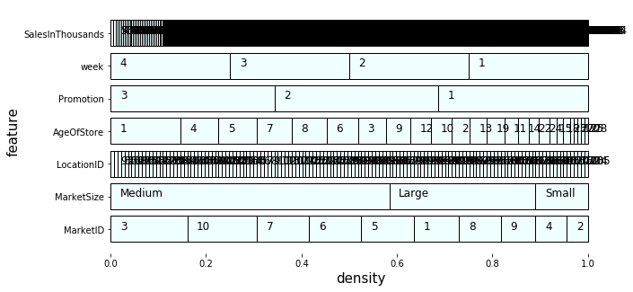
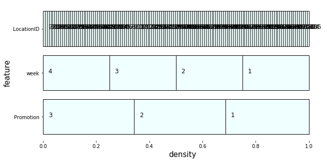

# A General Collection of EDA tools
This is a collection of some code that I will always re-use in exploratory data analysis.

## Discrete Inspector
A fast way to get a first idea of a new dataset. Whenever we first look at a new dataset, we always want to know if a single feature is categorical or continuous. Although, there is no scientific way to get this answer and will always require human inspection, by using this function, we can quickly inspect the characteristics of the whole dataset by visualize it.

```python
import pandas as pd
import matplotlib.pyplot as plt
from discrete_inspector import *

in_df = pd.read_csv('./data/Marketing_Campaign_Effectiveness.csv')
```
We can then plot all the features by: <br>

```python
plt.figure(figsize=(10,5))
discrete_inspector(in_df)
plt.show()
```


Or we can plot a list of features by: <br>
```python
plt.figure(figsize=(10,5))
discrete_inspector(in_df, ['Promotion','week', 'LocationID'])
plt.show()
```


This tool will provide a fast way to determine if a specific feature is categorical or continuous. For instance, SaleInThousands and LocationID are continuous, and the rest are categorical.

[Demo Jupyter Notebook](./discrete_inspector.ipynb)

--End of Discrete Inspector--
